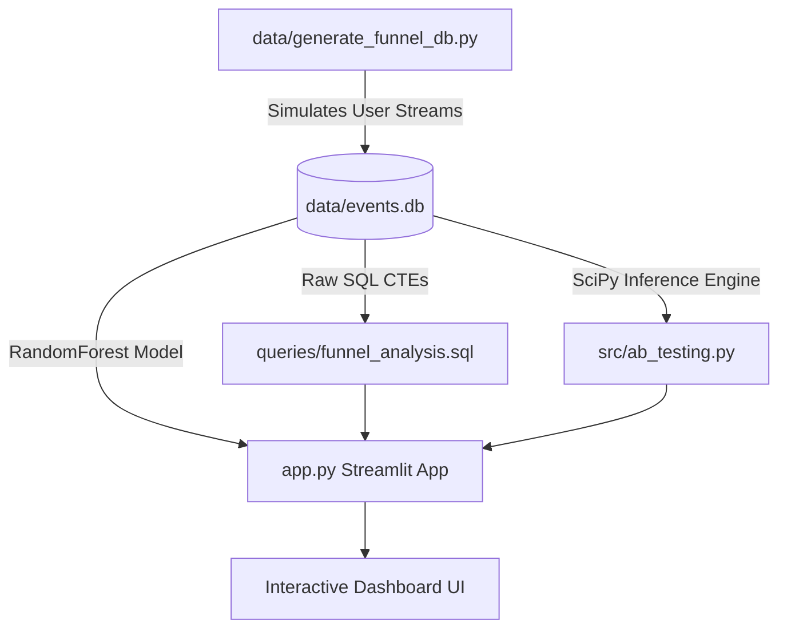

# 🧬 Helix Funnel Analytics: Boosting E-Commerce Sales with Smart Product Design

👉 **Live Dashboard Application:** [funnel-analytics.streamlit.app](https://funnel-analytics.streamlit.app/)

Helix Funnel Analytics is a product analytics platform and business case study. It demonstrates how to use data engineering, statistical testing, and machine learning to identify user friction points and optimize sales funnels.

---

##  Executive Summary: Improving the Checkout Journey

### 1. The Business Challenge
An e-commerce platform was losing significant revenue due to customers abandoning their shopping carts during checkout. To address this, the product team designed a new, simplified checkout process (**Variant B**) with fewer form fields and faster loading times. We ran an experiment to test this new design against the old checkout flow (**Control A**).

### 2. The Experiment
We tracked 10,000 unique users divided equally between the two designs over a 30-day period. We measured two key outcomes:
- **Conversion Rate:** The percentage of visitors who successfully completed a purchase.
- **Checkout Speed:** The average time in minutes it took for a user to go from viewing a product to purchasing it.

### 3. Key Discoveries
The analysis confirmed that the new design was a major success:
- **Significant Sales Boost:** The simplified checkout flow (Variant B) achieved a major increase in completed purchases compared to the legacy design. This change is statistically verified as a real improvement, not just a result of random chance.
- **Faster Checkout Times:** Customers completed their purchases several minutes faster in the new design. This confirms that removing redundant form fields successfully reduced checkout friction and saved customer time.
- **Predicting Purchase Behavior:** Using a machine learning model, we confirmed that early session interactions—specifically adding items to a cart and starting checkout—are the strongest indicators of whether a user will buy, highlighting the importance of optimizing early funnel stages.

### 4. Projected Business Impact
For a store processing **1 million monthly product views** with an **Average Order Value of \$50**:
- The new checkout design increases monthly revenue by over **\$2 Million** (representing a **\$24 Million** annualized revenue increase).
- This proves that small, data-driven design modifications can yield massive financial returns.

---

## 🛠 System Architecture & Technical Stack



- **Data Engineering:** A database script ([generate_funnel_db.py](file:///c:/Users/vijayendravarma/Desktop/RESUME_PROJECTS/Data%20Analyst/product-funnel-analysis/data/generate_funnel_db.py)) simulates user sessions and generates a SQLite database ([events.db](file:///c:/Users/vijayendravarma/Desktop/RESUME_PROJECTS/Data%20Analyst/product-funnel-analysis/data/events.db)) containing session logs.
- **SQL Analysis:** A SQL file ([funnel_analysis.sql](file:///c:/Users/vijayendravarma/Desktop/RESUME_PROJECTS/Data%20Analyst/product-funnel-analysis/queries/funnel_analysis.sql)) uses Common Table Expressions to calculate funnel drops and conversion metrics.
- **Hypothesis Testing Engine:** A statistical module ([ab_testing.py](file:///c:/Users/vijayendravarma/Desktop/RESUME_PROJECTS/Data%20Analyst/product-funnel-analysis/src/ab_testing.py)) runs Chi-Square tests and Welch's t-tests to confirm experiment validity.
- **Predictive ML Model:** A Random Forest classifier runs inside the dashboard to predict purchase probabilities.
- **Interactive Dashboard:** A Streamlit interface ([app.py](file:///c:/Users/vijayendravarma/Desktop/RESUME_PROJECTS/Data%20Analyst/product-funnel-analysis/app.py)) visually maps the funnel flow using Sankey flows, calculator bell curves, and predictions.

---

##  Easy Setup Instructions

### 1. Clone & Set Up Environment
Ensure you have Python 3.9+ installed. Set up a virtual environment:
```bash
python -m venv venv
venv\Scripts\activate      # On Windows
source venv/bin/activate   # On macOS/Linux
```

### 2. Install Dependencies
Install the required packages:
```bash
pip install -r requirements.txt
```

### 3. Generate SQLite Database
Simulate the user event log and create the database:
```bash
python data/generate_funnel_db.py
```

### 4. View Statistical Results in Terminal
Run the standalone analysis script to see p-values and lifts in the console:
```bash
python src/ab_testing.py
```

### 5. Launch the Visual Dashboard
Start the local interactive app in your browser:
```bash
streamlit run app.py
```
