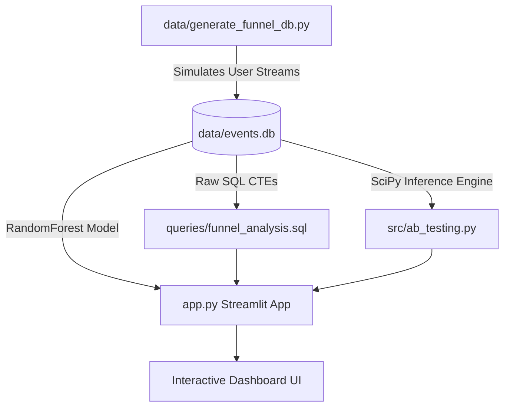

# 🧬 Helix Funnel Analytics: Optimizing Conversion with Statistical Rigor & Machine Learning

Helix Funnel Analytics is an enterprise-grade product analytics platform and case study. It demonstrates how to combine raw event-stream data engineering, rigorous statistical hypothesis testing, predictive machine learning, and interactive data visualization to solve critical conversion funnel friction.

---

##  Executive Case Study: Checkout Optimization

### 1. The Business Challenge
An e-commerce platform noticed significant cart abandonment and drop-offs during the checkout process, leading to lost revenue. The product team designed a new streamlined checkout interface (**Variant B**) designed to reduce form fields, introduce one-click defaults, and load payment details asynchronously, comparing it against the legacy flow (**Control A**).

### 2. Experiment Setup
- **Sample Size ($N$):** 10,000 unique users split evenly ($50/50$) between Control A and Variant B.
- **Duration:** 30 days of simulated user activity.
- **Metrics Evaluated:**
  - **Conversion Rate:** Proportion of users completing a `purchase` event out of those with a initial `view` event.
  - **Time-to-Conversion:** Total time elapsed (in minutes) between a user's initial `view` and their final `purchase` event.

### 3. Key Statistical Findings (SciPy Analysis)
The results below demonstrate absolute statistical significance, rejecting the null hypotheses for both conversion rate and conversion speed:

| Metric | Control A (Legacy) | Variant B (Optimized) | Experiment Delta | Statistical Significance | Test Used |
| :--- | :--- | :--- | :--- | :--- | :--- |
| **Conversion Rate (CR)** | $6.48\%$ ($322$ / $4,970$) | $10.50\%$ ($528$ / $5,030$) | **$+62.02\%$ relative lift** ($+4.02\%$ absolute diff) | **Statistically Significant** ($p = 7.61 \times 10^{-13}$) | Chi-Square Test of Independence |
| **Mean Time-to-Conversion** | $28.09$ minutes | $20.28$ minutes | **$7.80$ minutes faster** ($-27.76\%$ duration) | **Statistically Significant** ($p = 2.28 \times 10^{-11}$) | Welch's Two-Sample t-test |
| **Effect Size (Cohen's d)** | — | — | **$0.5396$** (Medium effect size) | Yes | Cohen's d |

> [!NOTE]
> The **95% Confidence Interval** for the conversion rate difference is **$[2.93\%, 5.11\%]$**, showing that we are 95% confident that the true conversion lift lies in this positive range.
> The **95% Confidence Interval** for the conversion time reduction is **$[5.57, 10.04]$ minutes**, proving that Variant B significantly accelerates checkout.

### 4. Projected Business Impact
Assuming a baseline of **1,000,000 monthly unique views** and an **Average Order Value (AOV) of \$50**:
* **Control A Monthly Revenue:** $1,000,000 \times 6.48\% \times \$50 = \mathbf{\$3,240,000}$
* **Variant B Monthly Revenue:** $1,000,000 \times 10.50\% \times \$50 = \mathbf{\$5,250,000}$
* **Incremental Monthly Uplift:** $\mathbf{+\$2,010,000}$ (An incremental **\$24.12 Million** annualized!)

---

## 🛠 System Architecture & Technical Stack



- **Database Layer:** SQLite (`data/events.db`) containing a raw events stream (schema: `user_id`, `timestamp`, `event_type` [view, cart, checkout, purchase], `device`, `traffic_source`, `ab_group`).
- **Statistical Inference Module (`src/ab_testing.py`):** Uses `scipy.stats` to execute Chi-Square Contingency tests and Welch's t-tests, calculating exact p-values, confidence intervals, and Cohen's d effect sizes.
- **Predictive ML Module:** Trains a `RandomForestClassifier` (Scikit-Learn) to predict purchase conversions based on early session characteristics (`device`, `traffic_source`, `ab_group`, `added_to_cart`, `checkout_started`).
- **Interactive UI/UX (`app.py`):** Built with Streamlit, custom CSS (glassmorphic dark theme), and Plotly, featuring:
  - **Sankey Diagrams** showing user drop-offs.
  - **Bell Curves** demonstrating A/B test probability densities.
  - **Interactive SQL Sandbox Console** to run live SQLite queries directly on the dataset.

---

## 🚀 Step-by-Step Setup Instructions

### 1. Clone & Set Up Environment
Ensure you have Python 3.9+ installed. Clone this repository, navigate to the directory, and set up a virtual environment:
```bash
python -m venv venv
venv\Scripts\activate      # On Windows
source venv/bin/activate   # On macOS/Linux
```

### 2. Install Dependencies
Install the required packages:
```bash
pip install -r requirements.txt
```

### 3. Generate SQLite Database
Generate the raw event stream database containing the user sessions:
```bash
python data/generate_funnel_db.py
```
*This creates the database file `data/events.db` and prints basic cohort sizes.*

### 4. Execute Statistical A/B Analysis
Run the standalone statistical analysis script to inspect p-values and confidence intervals directly in the terminal:
```bash
python src/ab_testing.py
```

### 5. Launch the Streamlit Dashboard
Start the local visualization server to explore the premium interactive dashboard:
```bash
streamlit run app.py
```
*The app will automatically open in your default browser at `http://localhost:8501`.*

---

## 💾 Funnel Analysis SQL CTE Query
The query below (stored in `queries/funnel_analysis.sql`) demonstrates advanced SQL engineering, using Common Table Expressions to pivot user event streams and calculate step-by-step conversion and drop-off metrics:

```sql
WITH user_funnel_stages AS (
    SELECT 
        user_id,
        ab_group,
        MAX(CASE WHEN event_type = 'view' THEN 1 ELSE 0 END) AS has_view,
        MAX(CASE WHEN event_type = 'cart' THEN 1 ELSE 0 END) AS has_cart,
        MAX(CASE WHEN event_type = 'checkout' THEN 1 ELSE 0 END) AS has_checkout,
        MAX(CASE WHEN event_type = 'purchase' THEN 1 ELSE 0 END) AS has_purchase
    FROM events
    GROUP BY user_id, ab_group
),
funnel_aggregates AS (
    SELECT
        ab_group,
        SUM(has_view) AS views,
        SUM(has_cart) AS carts,
        SUM(has_checkout) AS checkouts,
        SUM(has_purchase) AS purchases
    FROM user_funnel_stages
    GROUP BY ab_group
    UNION ALL
    SELECT
        'Overall' AS ab_group,
        SUM(has_view) AS views,
        SUM(has_cart) AS carts,
        SUM(has_checkout) AS checkouts,
        SUM(has_purchase) AS purchases
    FROM user_funnel_stages
)
SELECT
    ab_group,
    views AS stage_1_views,
    carts AS stage_2_carts,
    ROUND(CAST(carts AS REAL) / views * 100, 2) AS view_to_cart_conv_pct,
    ROUND((1.0 - CAST(carts AS REAL) / views) * 100, 2) AS view_to_cart_drop_pct,
    checkouts AS stage_3_checkouts,
    ROUND(CAST(checkouts AS REAL) / carts * 100, 2) AS cart_to_checkout_conv_pct,
    ROUND((1.0 - CAST(checkouts AS REAL) / carts) * 100, 2) AS cart_to_checkout_drop_pct,
    purchases AS stage_4_purchases,
    ROUND(CAST(purchases AS REAL) / checkouts * 100, 2) AS checkout_to_purchase_conv_pct,
    ROUND((1.0 - CAST(purchases AS REAL) / checkouts) * 100, 2) AS checkout_to_purchase_drop_pct,
    ROUND(CAST(purchases AS REAL) / views * 100, 2) AS overall_conversion_pct
FROM funnel_aggregates;
```
